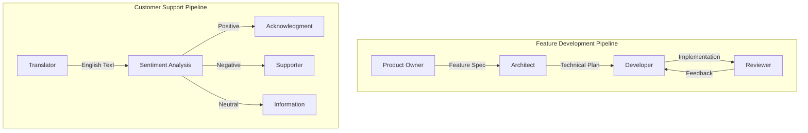

# Sudoku Solver CLI

A simple Node.js console tool that solves standard 9x9 sudoku puzzles supplied as text files. Empty cells are represented with `*` and filled cells with digits `1-9`.

This repository also serves as a demonstration of **GitHub Copilot Agent Handoff** functionality, showcasing how multiple specialized agents can collaborate on tasks.

## Table of Contents

- [Requirements](#requirements)
- [Installation](#installation)
- [Usage](#usage)
- [Development](#development)
- [Testing](#testing)
- [GitHub Copilot Agents](#github-copilot-agents)

## Requirements

- Node.js 18+
- npm 9+

## Installation

```bash
npm install
npm run build
```

This will generate the executable script at `dist/index.js` and register it as `sudoku-solver` via the `bin` entry in `package.json`.

## Usage

Provide the path to a puzzle file as the first CLI argument:

```bash
npm run build
node dist/index.js examples/valid-puzzle.txt
```

Or, after installing globally/local linking:

```bash
npm run build
npm link
sudoku-solver examples/valid-puzzle.txt
```

### Puzzle Format

- Exactly 9 lines, each with 9 characters
- Digits `1-9` denote known values
- `*` denotes an empty cell

Example:

```
53**7****
6**195***
*98****6*
8***6***3
4**8*3**1
7***2***6
*6****28*
***419**5
****8**79
```

### Output

Solved puzzles print as a formatted grid with 3x3 separators:

```
5 3 4 | 6 7 8 | 9 1 2
6 7 2 | 1 9 5 | 3 4 8
1 9 8 | 3 4 2 | 5 6 7
------+-------+------
8 5 9 | 7 6 1 | 4 2 3
4 2 6 | 8 5 3 | 7 9 1
7 1 3 | 9 2 4 | 8 5 6
------+-------+------
9 6 1 | 5 3 7 | 2 8 4
2 8 7 | 4 1 9 | 6 3 5
3 4 5 | 2 8 6 | 1 7 9
```

### Error Handling

The CLI reports descriptive errors for:

- Missing or unreadable files
- Invalid characters or wrong grid dimensions
- Sudoku rule violations (duplicate numbers in rows, columns, or boxes)
- Unsolvable puzzles

## Development

Run the tool without building using ts-node:

```bash
npm start -- examples/valid-puzzle.txt
```

## Testing

Execute the unit test suite with:

```bash
npm test
```

## GitHub Copilot Agents

This repository includes custom GitHub Copilot agent definitions that demonstrate the **agent handoff** pattern. Agents are defined in the `.github/agents/` directory and can collaborate by handing off tasks to one another.

### Agent Handoff Architecture

The following diagram illustrates how agents can hand off tasks to each other:



### Available Agents

| Agent | Description | Hands Off To |
|-------|-------------|--------------|
| **Product Owner** | Gathers requirements and creates feature specifications | Architect |
| **Architect** | Designs technical implementation plans | Developer |
| **Developer** | Implements features based on technical plans | Reviewer |
| **Reviewer** | Reviews code quality and creates tests | Developer (for fixes) |
| **Translator** | Translates user input to English | Sentiment Analysis |
| **Sentiment Analysis** | Classifies message sentiment | Acknowledgment, Supporter, or Information |
| **Acknowledgment** | Responds to positive messages | — |
| **Supporter** | Provides empathetic responses to negative messages | — |
| **Information** | Provides neutral, factual responses | — |

### Agent Details

#### Feature Development Pipeline

This pipeline demonstrates a complete software development workflow:

1. **Product Owner Agent** (`product-owner.agent.md`)
   - Gathers requirements through interactive questioning
   - Creates detailed feature specifications with user stories and acceptance criteria
   - Focuses purely on behavior and requirements, not implementation

2. **Architect Agent** (`architect.agent.md`)
   - Analyzes feature specifications
   - Designs high-level architecture
   - Creates detailed implementation task lists
   - Identifies risks and mitigation strategies

3. **Developer Agent** (`developer.agent.md`)
   - Implements the technical plan
   - Executes tasks from the todo list
   - Documents challenges and solutions

4. **Reviewer Agent** (`reviewer.agent.md`)
   - Evaluates code quality and standards
   - Verifies functionality against requirements
   - Creates comprehensive tests
   - Provides feedback for improvements

#### Customer Support Pipeline

This pipeline demonstrates sentiment-aware customer interaction:

1. **Translator Agent** (`translator.agent.md`)
   - Translates messages from any language to English
   - Preserves original meaning and context
   - Records the source language for response localization

2. **Sentiment Analysis Agent** (`sentiment.agent.md`)
   - Classifies sentiment as Positive, Negative, or Neutral
   - Routes to appropriate response agent based on classification

3. **Response Agents**
   - **Acknowledgment Agent** (`acknowledgment.agent.md`): Warm, appreciative responses for positive feedback
   - **Supporter Agent** (`supporter.agent.md`): Empathetic, comforting responses for negative sentiment
   - **Information Agent** (`information.agent.md`): Factual, neutral responses for informational queries

### Using the Agents

To use these agents in VS Code with GitHub Copilot:

1. Open the Command Palette (`Cmd+Shift+P` on macOS / `Ctrl+Shift+P` on Windows/Linux)
2. Select **GitHub Copilot: Open Chat**
3. Reference an agent using `@workspace` and mention the agent name, or invoke them directly via the agent picker

> [!TIP]
> Start with the **Product Owner** agent when planning new features, or the **Translator** agent when handling multilingual customer feedback.

### Creating Custom Agents

Agent definitions use the `.agent.md` format with YAML frontmatter:

```yaml
---
description: 'Agent description'
tools: ['vscode', 'execute', 'read', 'edit', 'search', 'web', 'agent', 'memory', 'todo']
model: Claude Opus 4.5 (Preview) (copilot)
handoffs: 
  - label: Handoff Button Label
    agent: target-agent-name
    prompt: Instructions for the target agent
    send: true
---
```

Key frontmatter properties:

- **description**: Brief description of the agent's purpose
- **tools**: Array of tools the agent can use
- **model**: The AI model to use (optional)
- **handoffs**: Array of handoff configurations
  - **label**: Button text shown to the user
  - **agent**: Target agent filename (without `.agent.md`)
  - **prompt**: Context passed to the target agent
  - **send**: Whether to automatically send (true) or let user review (false)

> [!NOTE]
> Agent files must be placed in the `.github/agents/` directory to be recognized by GitHub Copilot.
