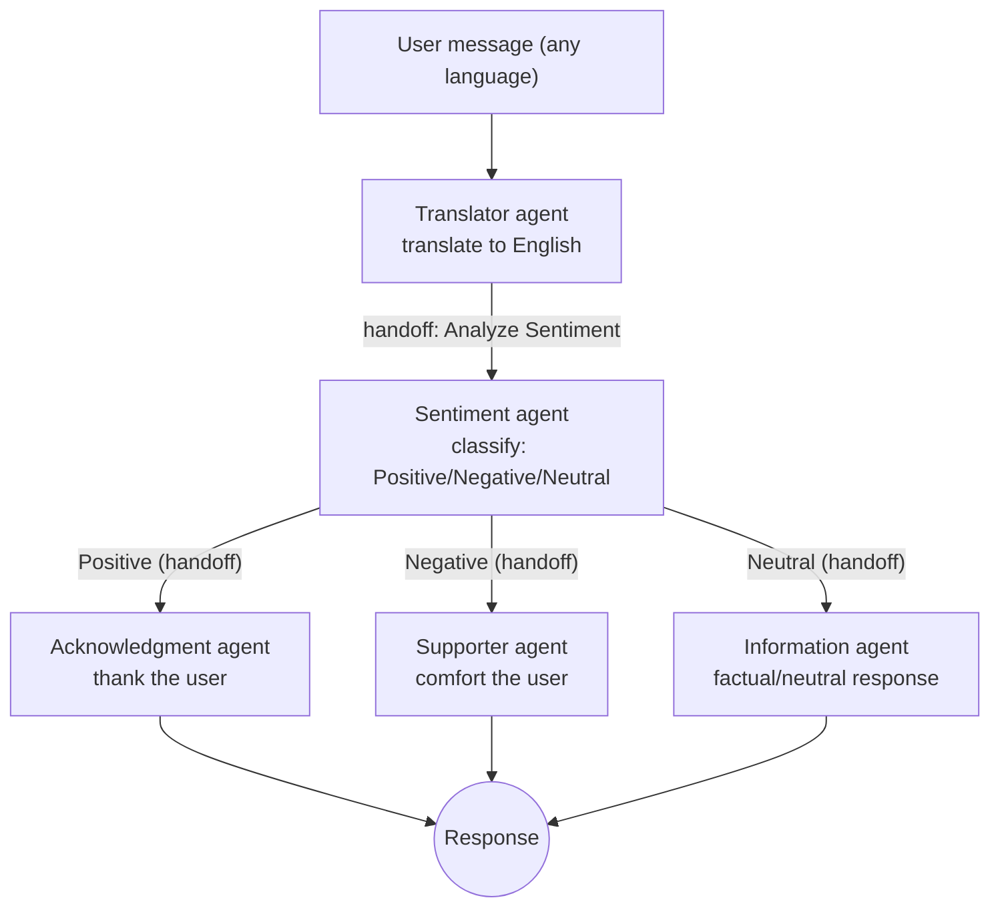

# Agents handoff demo (VS Code Custom Agents)

This repo is a small, workspace-scoped demo of **VS Code Custom Agents** and **handoffs** using `.agent.md` files.

The agent definitions live in:

- `.github/agents/*.agent.md`

VS Code automatically detects `.agent.md` files in `.github/agents` and surfaces them as **custom agents** (or keeps them internal if configured that way).

## What “custom agents” are

Per the VS Code docs, a **custom agent** is a reusable configuration defined in an `.agent.md` file:

- **Instructions**: the Markdown body becomes prepended guidance when the agent runs.
- **Configuration (YAML frontmatter)**: name/description, available tools, model selection, visibility, and optional **handoffs**.

Official docs: https://code.visualstudio.com/docs/copilot/customization/custom-agents

## What this repo implements

This repo implements a guided workflow:

1. **Translator** (entry point): translate user text to English
2. Handoff to **Sentiment**: classify as Positive / Negative / Neutral
3. Handoff to one of:
   - **Acknowledgment** (for Positive)
   - **Supporter** (for Negative)
   - **Information** (for Neutral)

### Guided Workflow

## The agents (what’s in `.github/agents/`)

### `translator.agent.md`

- Purpose: translate input text **to English**, preserving meaning/context.
- Model: `Claude Sonnet 4 (copilot)` (as configured in frontmatter).
- Handoffs:
  - **Analyze Sentiment** → `sentiment` (`send: true`)

Notes:
- This file does **not** set `user-invokable: false`, so it’s the natural “entry” agent that can appear in the Agents dropdown.

### `sentiment.agent.md`

- Purpose: sentiment classification (Positive / Negative / Neutral) + short explanation.
- Model: `Claude Sonnet 4.5` (as configured).
- Visibility: `user-invokable: false` (hidden from the picker by default; useful as an internal step).
- Handoffs (all `send: true`):
  - Provide Support Response → `supporter`
  - Provide Acknowledgment Response → `acknowledgment`
  - Provide Information Response → `information` (overrides model to `GPT-5-mini (Copilot)` in the handoff entry)

### `acknowledgment.agent.md`

- Purpose: respond warmly and thankfully when the message sentiment is positive.
- Visibility: `user-invokable: false`.

### `supporter.agent.md`

- Purpose: provide an empathetic, comforting response for negative/sad sentiment.
- Visibility: `user-invokable: false`.

### `information.agent.md`

- Purpose: provide a neutral, factual response for neutral sentiment.
- Visibility: `user-invokable: false`.

## How handoffs work (in VS Code)

**Handoffs** are defined in the YAML frontmatter under `handoffs:`.

After an agent responds, VS Code shows **handoff buttons** that:

- switch you to another agent, and
- optionally prefill a prompt, and
- if `send: true`, auto-submit that prompt after switching.

This enables guided, step-by-step workflows where you (the developer) remain in control by choosing the next step.

Docs section: https://code.visualstudio.com/docs/copilot/customization/custom-agents#_handoffs

## How to try the demo

1. Open this folder in VS Code.
2. Open the Chat view.
3. Select **Translator** from the agent picker.
4. Enter text in any language. (E.g., “Estoy muy feliz con el servicio” or “I am disappointed with the product”)
5. After translation, click the **Analyze Sentiment** handoff.
6. From the sentiment result, click the handoff that matches the classification to get the final response.

## How this differs from “subagents”

- **Handoffs**: UI-driven transitions between agents (buttons shown after a response). They create a guided workflow and can carry a prefilled prompt.
- **Subagents**: a main agent *spawns* a child agent in an isolated context window and waits for a summary result.

This repo primarily demonstrates **handoffs** (not subagent orchestration).

If you want this workflow to run fully automatically inside a single session, look into subagents:

- https://code.visualstudio.com/docs/copilot/agents/subagents

