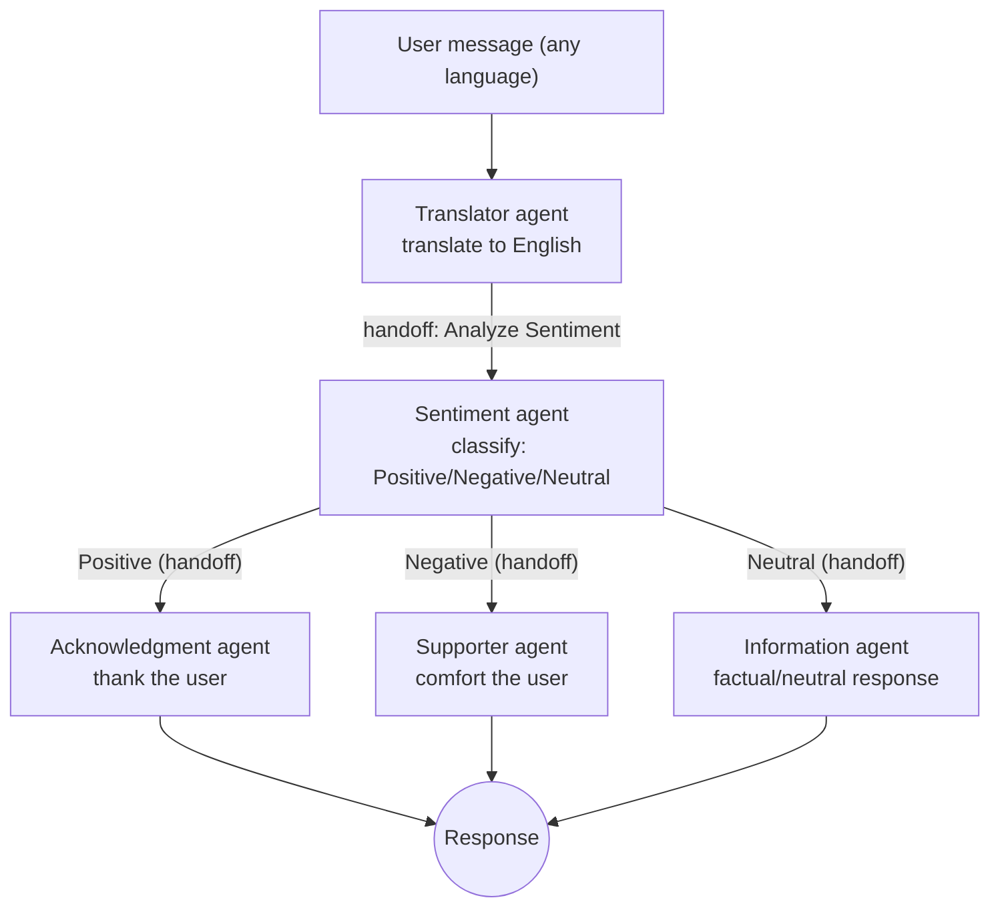

# Agents handoff demo (VS Code Custom Agents)

This repo is a small, workspace-scoped demo of **VS Code Custom Agents** and **handoffs** using `.agent.md` files.

The agent definitions live in:

- `.github/agents/*.agent.md`

VS Code automatically detects `.agent.md` files in `.github/agents` and surfaces them as **custom agents** (or keeps them internal if configured that way).

## What “custom agents” are

Per the VS Code docs, a **custom agent** is a reusable configuration defined in an `.agent.md` file:

- **Instructions**: the Markdown body becomes prepended guidance when the agent runs.
- **Configuration (YAML frontmatter)**: name/description, available tools, model selection, visibility, and optional **handoffs**.

Official docs: https://code.visualstudio.com/docs/copilot/customization/custom-agents

## What this repo implements

This repo implements the same support workflow in **two modes**:

### Manual mode (handoffs)

Step-by-step, with a human clicking each handoff button:

1. **Translator** (entry point): translate user text to English
2. Handoff to **Sentiment**: classify as Positive / Negative / Neutral
3. Handoff to one of:
   - **Acknowledgment** (for Positive)
   - **Supporter** (for Negative)
   - **Information** (for Neutral)

### Automated mode (User Support Operator)

Fully automatic — the **User Support Operator** agent orchestrates the same agents as subagents and returns a single final response with no manual steps.

### Workflow diagram

## The agents (what’s in `.github/agents/`)

### `translator.agent.md`

- Purpose: translate input text **to English**, preserving meaning/context.
- Model: `Claude Sonnet 4 (copilot)` (as configured in frontmatter).
- Handoffs:
  - **Analyze Sentiment** → `sentiment` (`send: true`)

Notes:
- This file does **not** set `user-invokable: false`, so it’s the natural “entry” agent that can appear in the Agents dropdown.

### `sentiment.agent.md`

- Purpose: sentiment classification (Positive / Negative / Neutral) + short explanation.
- Model: `Claude Sonnet 4.5` (as configured).
- Visibility: `user-invokable: false` (hidden from the picker by default; useful as an internal step).
- Handoffs (all `send: true`):
  - Provide Support Response → `supporter`
  - Provide Acknowledgment Response → `acknowledgment`
  - Provide Information Response → `information` (overrides model to `GPT-5-mini (Copilot)` in the handoff entry)

### `acknowledgment.agent.md`

- Purpose: respond warmly and thankfully when the message sentiment is positive.
- Visibility: `user-invokable: false`.

### `supporter.agent.md`

- Purpose: provide an empathetic, comforting response for negative/sad sentiment.
- Visibility: `user-invokable: false`.

### `information.agent.md`

- Purpose: provide a neutral, factual response for neutral sentiment.
- Visibility: `user-invokable: false`.

### `user-support-operator.agent.md`

- Purpose: run the **entire support flow end-to-end** (translate → sentiment → response) in a single interaction, with no manual clicks required.
- Model: `GPT-5.2 (copilot)`.
- Visibility: `user-invokable: true` — appears in the agent picker alongside the Translator.
- Configuration highlights:
  - `disable-model-invocation: true` — the operator never generates text itself; it only orchestrates subagents.
  - `tools: ['agent']` — grants the ability to spawn subagents.
  - `agents: ['translator', 'sentiment', 'supporter', 'acknowledgment', 'information']` — declares the full set of subagents it can invoke.
- Flow:
  1. Spawns **Translator** as a subagent → receives `translatedMessage`, `originalLanguage`, `originalMessage`.
  2. Spawns **Sentiment** as a subagent (passing all three fields) → receives sentiment classification + preserved metadata.
  3. Based on the sentiment, spawns **Acknowledgment**, **Supporter**, or **Information** as a subagent → returns only the final user-facing response.

## How handoffs work (in VS Code)

**Handoffs** are defined in the YAML frontmatter under `handoffs:`.

After an agent responds, VS Code shows **handoff buttons** that:

- switch you to another agent, and
- optionally prefill a prompt, and
- if `send: true`, auto-submit that prompt after switching.

This enables guided, step-by-step workflows where you (the developer) remain in control by choosing the next step.

Docs section: https://code.visualstudio.com/docs/copilot/customization/custom-agents#_handoffs

## How to try the demo

This repo ships **two ways** to run the same workflow: a manual handoff flow and a fully automated e2e flow.

### Option A — Manual flow (handoffs)

1. Open this folder in VS Code.
2. Open the Chat view.
3. Select **Translator** from the agent picker.
4. Enter text in any language. (E.g., "Estoy muy feliz con el servicio" or "I am disappointed with the product")
5. After translation, click the **Analyze Sentiment** handoff button.
6. From the sentiment result, click the handoff that matches the classification to get the final response.

You stay in control at every step — each agent responds, then you choose the next handoff.

### Option B — End-to-end flow (User Support Operator)

1. Open this folder in VS Code.
2. Open the Chat view.
3. Select **User Support Operator** from the agent picker.
4. Enter text in any language.
5. The operator automatically runs Translator → Sentiment → the appropriate responder agent behind the scenes and returns **one final response** — no clicks needed.

## Handoffs vs. end-to-end (subagent) flow

This repo demonstrates **both** patterns side by side:

| | Manual flow (handoffs) | E2E flow (User Support Operator) |
|---|---|---|
| **Mechanism** | Handoff buttons shown after each agent response | Orchestrator spawns subagents programmatically |
| **User interaction** | You click a button at each step | Single message in, single response out |
| **Control** | You decide which handoff to follow | The operator decides automatically based on sentiment |
| **Visibility** | You see each agent's intermediate output | Only the final response is shown |
| **Entry point** | `@Translator` | `@User Support Operator` |
| **Config key** | `handoffs:` in frontmatter | `tools: ['agent']` + `agents: [...]` in frontmatter |

### When to use which

- **Handoffs** are great for debugging, demos, or workflows where a human should review intermediate results before proceeding.
- **Subagent orchestration (e2e)** is better for production-style flows where the user just wants a final answer without stepping through each stage.

Docs:
- Handoffs: https://code.visualstudio.com/docs/copilot/customization/custom-agents#_handoffs
- Subagents: https://code.visualstudio.com/docs/copilot/agents/subagents

